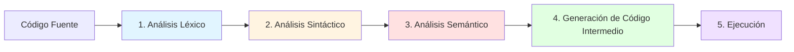

# 🔧 Fases del Compilador - Guía Completa

Este documento explica las **fases más importantes** del compilador implementado en este proyecto, siguiendo la teoría del "Dragon Book".

---

## 📋 Resumen de las Fases

El compilador procesa el código fuente en **5 fases principales**:



---

## 1️⃣ Análisis Léxico (Lexer)

**Archivo:** [`Lexer.cs`](file:///home/daniel_gil/Documentos/Compilador/Lexer.cs)

### 🎯 Propósito
Convierte el código fuente (texto plano) en una secuencia de **tokens** (unidades léxicas).

### 🔍 Qué hace
- Lee el código carácter por carácter
- Identifica palabras clave (`if`, `while`, `for`, `var`, etc.)
- Reconoce identificadores (nombres de variables)
- Detecta números (enteros, flotantes, hexadecimales)
- Identifica operadores (`+`, `-`, `*`, `/`, `==`, `!=`, etc.)
- Maneja cadenas de texto
- Rastrea líneas y columnas para reportar errores

### 📝 Ejemplo

**Entrada:**
```csharp
var x = 10;
```

**Salida (Tokens):**
```
VAR "var"
IDENTIFIER "x"
EQUAL "="
NUMBER 10
SEMICOLON ";"
```

### 🔑 Métodos Clave
- `ScanTokens()`: Escanea todo el código fuente
- `ScanToken()`: Procesa un token individual
- `Number()`: Reconoce números (incluyendo hex y notación científica)
- `Identifier()`: Reconoce identificadores y palabras clave
- `String()`: Procesa cadenas de texto

---

## 2️⃣ Análisis Sintáctico (Parser)

**Archivo:** [`Parser.cs`](file:///home/daniel_gil/Documentos/Compilador/Parser.cs)

### 🎯 Propósito
Convierte la secuencia de tokens en un **Árbol de Sintaxis Abstracta (AST)** que representa la estructura del programa.

### 🔍 Qué hace
- Verifica que los tokens sigan la gramática del lenguaje
- Construye un árbol jerárquico de expresiones y sentencias
- Detecta errores de sintaxis (paréntesis sin cerrar, punto y coma faltante, etc.)
- Implementa **Descenso Recursivo** para parsear la gramática

### 📝 Ejemplo

**Entrada (Tokens):**
```
IF LEFT_PAREN IDENTIFIER GREATER NUMBER RIGHT_PAREN ...
```

**Salida (AST):**
```
IfStmt
├── Condición: BinaryExpr (x > 5)
│   ├── Left: Variable "x"
│   ├── Operator: GREATER
│   └── Right: Literal 5
└── ThenBranch: PrintStmt
    └── Expression: Literal "Mayor"
```

### 🔑 Métodos Clave
- `Parse()`: Punto de entrada, parsea todo el programa
- `Declaration()`: Parsea declaraciones (variables)
- `Statement()`: Parsea sentencias (`if`, `while`, `for`, `print`, etc.)
- `Expression()`: Parsea expresiones siguiendo precedencia de operadores
- `Primary()`: Parsea literales, variables, y expresiones entre paréntesis

### 📐 Jerarquía de Precedencia
```
Assignment (más baja)
  ↓
Or (||)
  ↓
And (&&)
  ↓
Equality (==, !=)
  ↓
Comparison (<, >, <=, >=)
  ↓
Term (+, -)
  ↓
Factor (*, /)
  ↓
Unary (!, -)
  ↓
Primary (más alta)
```

---

## 3️⃣ Análisis Semántico (TypeChecker)

**Archivo:** [`TypeChecker.cs`](file:///home/daniel_gil/Documentos/Compilador/TypeChecker.cs)

### 🎯 Propósito
Verifica que el programa tenga **sentido semántico**: tipos correctos, variables declaradas, operaciones válidas.

### 🔍 Qué hace
- **Verifica tipos:** Asegura que las operaciones se realicen con tipos compatibles
- **Tabla de símbolos:** Verifica que las variables estén declaradas antes de usarse
- **Validación de condiciones:** Asegura que las condiciones de `if`, `while`, `for` sean booleanas
- **Compatibilidad de asignaciones:** Verifica que el tipo del valor coincida con el tipo de la variable
- **Operaciones de arrays:** Valida índices y tipos de elementos

### 📝 Ejemplos de Validaciones

#### ✅ Correcto
```csharp
int x = 10;
int y = x + 5;  // ✓ int + int = int
```

#### ❌ Error de Tipo
```csharp
int x = 10;
bool y = x + 5;  // ✗ No se puede asignar int a bool
```

#### ❌ Variable No Declarada
```csharp
x = 10;  // ✗ Variable 'x' no declarada
```

#### ❌ Condición No Booleana
```csharp
if (5) {  // ✗ La condición debe ser bool, no int
    print "Error";
}
```

### 🔑 Métodos Clave
- `Check()`: Verifica todo el programa
- `VisitVarStmt()`: Valida declaraciones de variables
- `VisitBinaryExpr()`: Verifica operaciones binarias (+, -, *, /, ==, etc.)
- `VisitAssignExpr()`: Valida asignaciones
- `VisitIfStmt()`, `VisitWhileStmt()`: Valida condiciones booleanas

### 🗂️ Tabla de Símbolos
**Archivo:** [`SymbolTable.cs`](file:///home/daniel_gil/Documentos/Compilador/SymbolTable.cs)

Gestiona los **ámbitos (scopes)** y las variables declaradas:
- Permite declarar variables en diferentes niveles de scope
- Busca variables en el scope actual y superiores
- Detecta redeclaraciones en el mismo scope

---

## 4️⃣ Generación de Código Intermedio (IRGenerator)

**Archivo:** [`IRGenerator.cs`](file:///home/daniel_gil/Documentos/Compilador/IRGenerator.cs)

### 🎯 Propósito
Traduce el AST a **Código de Tres Direcciones (Three-Address Code)**, una representación intermedia más cercana al código máquina.

### 🔍 Qué hace
- Convierte expresiones complejas en instrucciones simples
- Aplana el control de flujo usando **etiquetas** (`labels`) y **saltos** (`goto`, `if_false`)
- Genera variables temporales para resultados intermedios
- Traduce operaciones de arrays a instrucciones de bajo nivel

### 📝 Ejemplo

**Entrada (AST):**
```csharp
int x = 5 + 3 * 2;
```

**Salida (Código Intermedio):**
```
t0 = 3 * 2      // t0 = 6
t1 = 5 + t0     // t1 = 11
x = t1          // x = 11
```

### 📝 Ejemplo con Control de Flujo

**Entrada:**
```csharp
if (x > 5) {
    print "Mayor";
} else {
    print "Menor";
}
```

**Salida (Código Intermedio):**
```
t0 = x > 5
if_false t0 goto L0
print "Mayor"
goto L1
L0:
print "Menor"
L1:
```

### 🔑 Métodos Clave
- `Generate()`: Genera código para todo el programa
- `VisitBinaryExpr()`: Genera código para operaciones binarias
- `VisitIfStmt()`: Genera etiquetas y saltos para `if`
- `VisitWhileStmt()`: Genera bucles con etiquetas
- `NewTemp()`: Crea variables temporales
- `NewLabel()`: Crea etiquetas únicas

### 📦 Estructura del Código Intermedio
**Archivo:** [`ThreeAddressCode.cs`](file:///home/daniel_gil/Documentos/Compilador/ThreeAddressCode.cs)

Define las **instrucciones** y **códigos de operación (OpCodes)**:
- `ADD`, `SUB`, `MUL`, `DIV`: Operaciones aritméticas
- `EQ`, `NEQ`, `LT`, `GT`, `LTE`, `GTE`: Comparaciones
- `AND`, `OR`, `NOT`: Operaciones lógicas
- `ASSIGN`: Asignación
- `GOTO`, `IF_FALSE`: Control de flujo
- `LABEL`: Etiquetas
- `PRINT`: Salida
- `NEW_ARRAY`, `ARRAY_GET`, `ARRAY_SET`: Operaciones de arrays

---

## 5️⃣ Ejecución (IRInterpreter)

**Archivo:** [`IRInterpreter.cs`](file:///home/daniel_gil/Documentos/Compilador/IRInterpreter.cs)

### 🎯 Propósito
Ejecuta el código intermedio, simulando una **máquina virtual**.

### 🔍 Qué hace
- Mantiene un **entorno de memoria** para variables
- Ejecuta instrucciones secuencialmente
- Maneja saltos y etiquetas para control de flujo
- Evalúa operaciones aritméticas, lógicas y de arrays
- Imprime resultados

### 📝 Ejemplo de Ejecución

**Código Intermedio:**
```
t0 = 3 * 2
t1 = 5 + t0
x = t1
print x
```

**Ejecución:**
```
1. t0 = 6
2. t1 = 11
3. x = 11
4. Imprime: 11
```

### 🔑 Métodos Clave
- `Execute()`: Ejecuta todas las instrucciones
- `ExecuteInstruction()`: Ejecuta una instrucción individual
- `EvaluateOperand()`: Obtiene el valor de un operando (variable o literal)

---

## 🔄 Flujo Completo del Compilador

**Archivo:** [`Program.cs`](file:///home/daniel_gil/Documentos/Compilador/Program.cs)

Orquesta todo el proceso:

```csharp
// 1. Leer código fuente
string source = File.ReadAllText(args[0]);

// 2. Análisis Léxico
Lexer lexer = new Lexer(source);
List<Token> tokens = lexer.ScanTokens();

// 3. Análisis Sintáctico
Parser parser = new Parser(tokens);
List<Stmt> statements = parser.Parse();

// 4. Análisis Semántico
TypeChecker typeChecker = new TypeChecker();
typeChecker.Check(statements);

// 5. Generación de Código Intermedio
IRGenerator irGenerator = new IRGenerator();
List<Instruction> instructions = irGenerator.Generate(statements);

// 6. Ejecución
IRInterpreter irInterpreter = new IRInterpreter();
irInterpreter.Execute(instructions);
```

---

## 📊 Estructuras de Datos Importantes

### AST (Árbol de Sintaxis Abstracta)

#### **Expresiones** ([`Expr.cs`](file:///home/daniel_gil/Documentos/Compilador/Expr.cs))
- `Binary`: Operaciones binarias (`x + y`)
- `Unary`: Operaciones unarias (`-x`, `!flag`)
- `Literal`: Valores constantes (`10`, `"hola"`, `true`)
- `Variable`: Referencias a variables (`x`)
- `Assign`: Asignaciones (`x = 5`)
- `Logical`: Operadores lógicos (`and`, `or`)
- `Grouping`: Expresiones entre paréntesis
- `ArrayAccess`: Acceso a arrays (`arr[0]`)
- `ArrayAssign`: Asignación a arrays (`arr[0] = 5`)

#### **Sentencias** ([`Stmt.cs`](file:///home/daniel_gil/Documentos/Compilador/Stmt.cs))
- `Var`: Declaración de variables (`int x = 10;`)
- `Expression`: Sentencia de expresión (`x = 5;`)
- `Print`: Impresión (`print x;`)
- `Block`: Bloque de código (`{ ... }`)
- `If`: Condicional (`if (cond) { ... } else { ... }`)
- `While`: Bucle while (`while (cond) { ... }`)
- `For`: Bucle for (`for (init; cond; incr) { ... }`)
- `Do`: Bucle do-while (`do { ... } while (cond);`)
- `Break`: Salir de bucle
- `Continue`: Continuar bucle

### Sistema de Tipos ([`Types.cs`](file:///home/daniel_gil/Documentos/Compilador/Types.cs))
- `IntType`: Números enteros
- `FloatType`: Números flotantes
- `BoolType`: Booleanos
- `StringType`: Cadenas de texto
- `ArrayType`: Arrays (con tipo de elemento)
- `VoidType`: Tipo vacío

---

## 🧪 Archivos de Prueba

El proyecto incluye varios archivos de prueba:

- [`test.txt`](file:///home/daniel_gil/Documentos/Compilador/test.txt): Prueba básica
- [`test_variables.txt`](file:///home/daniel_gil/Documentos/Compilador/test_variables.txt): Declaraciones de variables
- [`test_conditionals.txt`](file:///home/daniel_gil/Documentos/Compilador/test_conditionals.txt): Condicionales
- [`test_loops.txt`](file:///home/daniel_gil/Documentos/Compilador/test_loops.txt): Bucles
- [`test_advanced.txt`](file:///home/daniel_gil/Documentos/Compilador/test_advanced.txt): Características avanzadas
- [`test_complex.txt`](file:///home/daniel_gil/Documentos/Compilador/test_complex.txt): Casos complejos
- [`test_dragon_a9.txt`](file:///home/daniel_gil/Documentos/Compilador/test_dragon_a9.txt): Ejemplo del Dragon Book

---

## 🎓 Conceptos Clave del Dragon Book

### Patrón Visitor
Usado en `Expr.cs` y `Stmt.cs` para recorrer el AST sin modificar las clases de nodos.

### Descenso Recursivo
Técnica de parsing usada en `Parser.cs` donde cada regla de la gramática tiene su propio método.

### Código de Tres Direcciones
Representación intermedia donde cada instrucción tiene como máximo tres operandos:
```
resultado = operando1 operador operando2
```

### Tabla de Símbolos con Scopes
Gestión de ámbitos anidados para variables locales y globales.

---

## 🚀 Cómo Ejecutar

```bash
# Compilar el proyecto
dotnet build

# Ejecutar un archivo de prueba
dotnet run test_loops.txt

# O directamente
dotnet run -- archivo.txt
```

---

## 📚 Resumen

| Fase | Archivo | Entrada | Salida | Propósito |
|------|---------|---------|--------|-----------|
| **1. Léxico** | `Lexer.cs` | Código fuente (texto) | Lista de tokens | Tokenización |
| **2. Sintáctico** | `Parser.cs` | Tokens | AST | Verificación de gramática |
| **3. Semántico** | `TypeChecker.cs` | AST | AST validado | Verificación de tipos |
| **4. Generación IR** | `IRGenerator.cs` | AST | Código intermedio | Traducción a bajo nivel |
| **5. Ejecución** | `IRInterpreter.cs` | Código intermedio | Salida del programa | Ejecución |

---

## 🔗 Referencias

- **Dragon Book**: "Compilers: Principles, Techniques, and Tools" por Aho, Lam, Sethi, Ullman
- **Patrón Visitor**: Diseño de patrones para recorrer estructuras de datos
- **Descenso Recursivo**: Técnica de parsing top-down

---

**¡Este compilador implementa todas las fases clásicas de un compilador moderno!** 🎉
